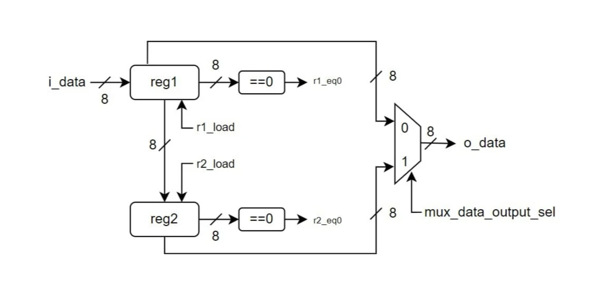
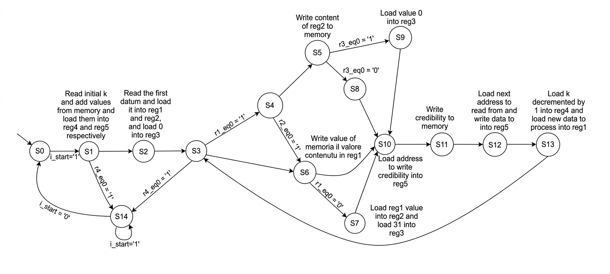

# Memory-Interfaced Logic Module Design

VHDL project implementing a memory-interfaced sequence processing module with FSM-based control logic.

## Overview

This project consists of a hardware module written in VHDL that processes a sequence of values stored in memory.

The module reads a sequence of `K` values from memory, applies a transformation based on specific rules, and writes the processed values back to memory along with a computed credibility score.

The design handles sequences containing zero values by replacing them with the last valid non-zero value and dynamically updating a credibility counter.

## Key Features

- VHDL implementation of a memory-interfaced hardware module  
- Modular architecture with clearly separated components  
- Finite State Machine (FSM) controlling the execution flow  
- Data path handling memory read/write operations  
- Credibility computation with decrement logic  
- Handling of edge cases such as:
  - sequences with only zero values  
  - reset during execution  
  - credibility reaching zero  

## Architecture

The system is composed of multiple interacting components:

- **Data Path** – manages data flow between registers and memory  
- **Finite State Machine (FSM)** – controls the execution flow  
- **Counters** – track sequence length and memory addresses  
- **Credibility Logic** – updates reliability values for each element  

### Data Path



### Finite State Machine



## Verification

The module was tested using multiple scenarios, including:

- empty sequences (`K = 0`)  
- multiple consecutive sequences  
- sequences containing only zeros  
- reset conditions during execution  
- correct decrement and reset of credibility values  

Simulation results confirmed correct functional behavior under all tested conditions.

## Results

- No latch inference during synthesis  
- Timing constraints successfully satisfied  
- Correct behavior verified through simulation and test cases  

## Technologies

- VHDL  
- Digital hardware design  
- Finite State Machines (FSM)  
- Memory interface logic  
- Simulation and synthesis tools  

## Repository Structure
```
├── src/        # VHDL source code
├── docs/       # Project documentation (report)
└── images/     # Architecture diagrams
```
## Documentation

The full project report is available here:

- [Project Report](docs/report.pdf)

## Authors

- Lucrezia Maestrello   

## Notes

This project was developed as part of an academic assignment for the Digital Logic Networks course at Politecnico di Milano.
